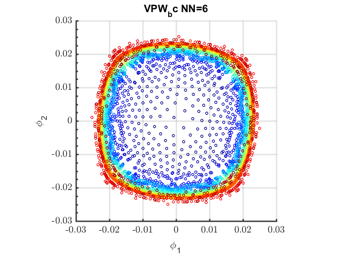

# Volume Corrected Affinity on Graph Laplacian
A volume corrected affinity on graph Laplacian approximates the optimal Parzen window or kernel bandwidth that leads to point wise convergence to its respective Laplace-Beltrami operator.
## How to use?
Run **nldr_interactive.m** file to open the interactive window. </img>
## Results on synthetic dataset
<table>
  <tr>
    <td></img></td>
    <td></img></td>
    <td></img></td>
  </tr>
  <tr>
    <td></img></td>
    <td></img></td>
    <td></img></td>
  </tr>
  <tr>
    <td></img></td>
    <td></img></td>
    <td></img></td>
  </tr>
  <tr>
    <td></img></td>
    <td></img></td>
    <td></img></td>
  </tr>
  <tr>
    <td></img></td>
    <td></img></td>
    <td></img></td>
  </tr>
  <tr>
    <td></img></td>
    <td></img></td>
    <td></img></td>
  </tr>
  <tr>
    <td></img></td>
    <td></img></td>
    <td></img></td>
  </tr>
  <tr>
    <td></img></td>
    <td></img></td>
    <td></img></td>
  </tr>
  <tr>
    <td></img></td>
    <td></img></td>
    <td></img></td>
  </tr>
  <tr>
    <td></img></td>
    <td></img></td>
    <td></img></td>
  </tr>
  <tr>
    <td></img></td>
    <td></img></td>
    <td></img></td>
  </tr>
  <tr>
    <td></img></td>
    <td></img></td>
    <td></img></td>
  </tr>
</table>
## Citations
<ol>
	<li>Manifold Regularization: a Geometric Framework for Learning from Examples, M. Belkin, P. Niyogi, V. Sindhwani, University of Chicago Computer Science Technical Report TR-2004-06, 2004[code](http://manifold.cs.uchicago.edu/manifold_regularization/manifold.html)</li>
</ol>